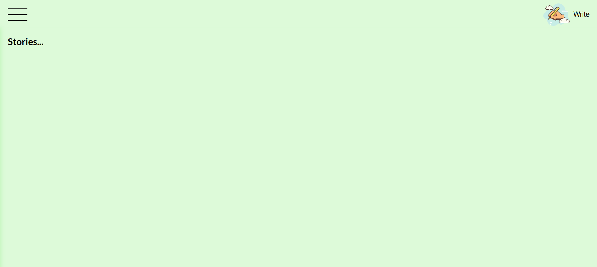

# Interactive Personal Blog Platform

## Project Description

This is a Interactive Personal Blog Platform from scratch. In this app, you can write your thoughts, store them, and manage them. By clicking on the top left page, either the write icon or the write text, you will see a form. In this 
Form: You must fill in the title input and the textarea with the details of your thoughts. after clicking on the save button, the data will be saved in your localStorage, then the list of your stored data will be shown. In this list,
each row has a button that shows you a more option icon, by clicking on this icon, you can choose edit or delete the specified data. By clicking on edit, the current data will be shown in the form and you can change it. By clicking
on delete, the chosen data will be deleted from the list and localstorage. On the top of the page, there is a menu icon that will show you a sidebar with just some text as an example. You can change this data as you wish and use it.

##



##

## Features

- Form is validated

## Technologies Used

- HTML5
- CSS3
- JavaScript (ES6+)
- DOM Manipulation

## How to Run the Application

### Method 1: Local File
1. Clone or download this repository to your local machine
2. Navigate to the project directory
3. Open `index.html` in your web browser (double-click the file or right-click and select "Open with" your preferred browser)

### Method 2: Using a Local Server (Optional)
If you're using VS Code:
1. Install the "Live Server" extension
2. Right-click on `index.html`
3. Select "Open with Live Server"

## Development Process & Reflection

### Planning Phase
- Design it
- Create the navbar and sidebar
- Create the show hide mode, so ifthe  user clicks on the write icon, it shows the user form, not the main page, and vice versa.
- Create the form and handle the rules and errors
- Show the data on the main page
- Add edit or remove button
- Save data in localstorage and show it to the user
- Handle edit/delete mod.

### Challenges Faced

#### Challenge 1: The design of it
**Problem:** It must be user-friendly
**Solution:** I used the Medium website as a reference and tried to design my website, like Medium.


## Features Not Implemented

- [ ] I did not handle the sidebar design for small phones.

## File Structure

```
SBA-5-The-Document-Object-Model/
├── index.html          # Main HTML file
├── styles.css          # CSS styling
├── script.js           # JavaScript DOM manipulation
├── images/             # Image assets
└── README.md           # Project documentation
```


👤 Author
Saba Beigi
🌎 Charlotte, NC
💼 GitHub @sababg
📧 beigisaba@gmail.com

Feel free to reach out with questions, feedback, or ideas!
